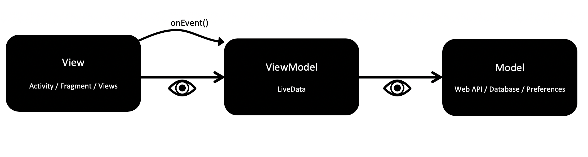
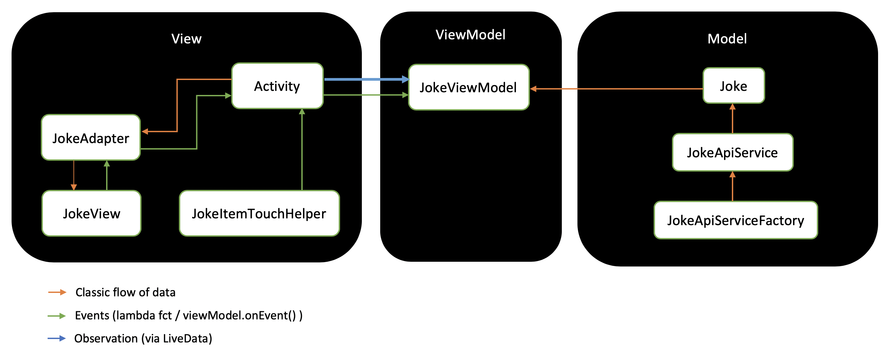

# MVVM pattern introduction

## Main goal
Goal is to clean up our app architecture. To do so, we'll migrate Chuck Norris app to **MVVM** pattern. We'll learn about [`androidx.lifecycle`][lifecycle] and [`ViewModel`][ViewModelOverview] component. 

## Steps
1. [Clean JokeView](#part1)
2. [Clean JokeAdapter](#part2)
2. [ViewModel pattern](#part3)

## Part 1 - Clean JokeView <a name="part1"/>
`JokeView` single responsibility is to display values from its `JokeView.Model`, that's all. One and **only** one public method should be able to update this `JokeView.Model` --> `setupView(model: Model)`. Finally, `JokeView` itself should not be able to change neither its own `Model`, neither its view params. The view should change only when `setupView(model)` is called. 

> :mag: *In clean archi, we often say that `View` is stupid and acts like a model-mirror.*
>
> :mag: *Note that `JokeView`'s callbacks (lambda methods) are also passed through `JokeView.Model`*

## Part 2 - Clean JokesAdapter <a name="part2"/>
`JokeAdapter` single responsibility is to create view holders that will hold jokes view models and pass it to `RecyclerView`, that's all. It should have one and **only** one public method which updates its data content then notifies its data set has changed. Its data content should not be updated another way and should remain private in `JokeAdapter`.

:warning: Important change here: until now, `JokeAdapter` data content was `List<Joke>`, and it was creating `JokeView.Model`s using `Joke`s data class, which is not actually correct in term of clean architecture. This conversion responsibility should not belong to `JokeAdapter`. It only needs some `JokeView.Model`s to inflate some `JokeView`s. So its data content becomes **`List<JokeView.Model>`**.

> :mag: *Data content should be a value: `val models: MutableList<JokeView.Model>`, then your previous custom setter should be replaced with a method --> `fun updateData(newModels: List<JokeView.Model>)`.*

## Part 3 - MVVM <a name="part3"/>
At this point, we cleaned both `JokeView` and `JokesAdapter`. Check that app behavior is kept unchanged.
 
#### MVVM pattern

- **Model** is the data we want to display
- **View** represents components (Activity, RecyclerView, Adapter) deciding how will that data be displayed on screen (UI)
- **ViewModel** is called the "mirror" or the View. It will decide what the View has to display.

#### MVVM in Chuck app

`MainActivity` is for the moment our source-of-truth, it owns all responsibilities. :warning: still not correct! In **MVVM** pattern, `Activity` belongs to **V** for **View** and, as we said previously, View should stay "stupid". In other words, our Activity should not store our list of Jokes, it should not decide when and how we should update the UI --> this will be moved to a new component, our view model owner : `JokesViewModel`.

### Build a `ViewModel`

:construction_worker_woman: WIP :hammer_and_pick:

JokesViewModel is the displayed joke list responsibility owner. The single source of truth concerning List<Joke>.

Usefull links :
- [MVVM in android](https://developer.android.com/jetpack/docs/guide)
- [`ViewModel`](https://developer.android.com/topic/libraries/architecture/viewmodel)

[lifecycle]: https://developer.android.com/jetpack/androidx/releases/lifecycle
[ViewModelOverview]: https://developer.android.com/topic/libraries/architecture/viewmodel
[ViewModel]: https://developer.android.com/reference/androidx/lifecycle/ViewModel

